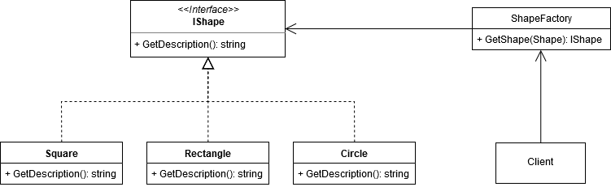

# Factory Method Pattern

Define an interface for creating an object, but let subclasses decide which class to instantiate. Factory Method lets a class defer instantiation to subclasses (Gang of Four).

In this example, a Factory for creating shapes is defined. The factory will instantiate a Shape based on an enum it is provided with, allowing other classes in the code to instantiate a particular Shape depending on their own implementation.

## UML Diagram of the example.

