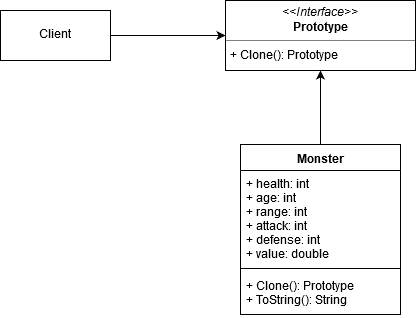

# Prototype Pattern

Specify the kinds of objects to create using a prototypical instance, and create new objects by copying this prototype. (Gang of Four).

In this example, we use a simple class `Monster` as our object to copy. The interface `Prototype` signals that any class that implements it is clonable. We can then clone any instance of `Monster` using the clone method. 

## UML Diagram of the example.

