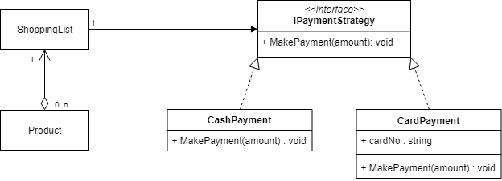

# Strategy Pattern

The Strategy Pattern allows one to define a family of algorithms, encapsulate each one, and make them interchangable. Strategy lets the algorithm vary independently from clients that use it. (Gang of Four)

The example implemented here consists of a shopping list which can contain several products. A specific algorithm can be chosen for the payment method when purchasing the items on the shopping list. In the example there are two different payment methods.

- Cash Payment
- Card Payment

These can be used interchangeably and swapped during run-time, fulfilling the requirements of the Strategy Pattern.

Here is a class diagram detailing this example:

