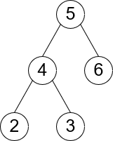

# Visitor Pattern

Represent an operation to be performed on the elements of an object structure. Visitor lets you define a new operation without changing the classes of the elements on which it operates (Gang of Four).

In this example, we implement a binary tree of integers with the following structure:

Using the visitor object `SumVisitor`, we transverse the binary tree and add up all of its values.

## UML Diagram of the example.

We can also define the visitor object `LeafNodeCountVisitor` which counts the number of leaf nodes in the tree. This demonstrates how we are able to add additional functionality without having to change any code in the tree itself.

